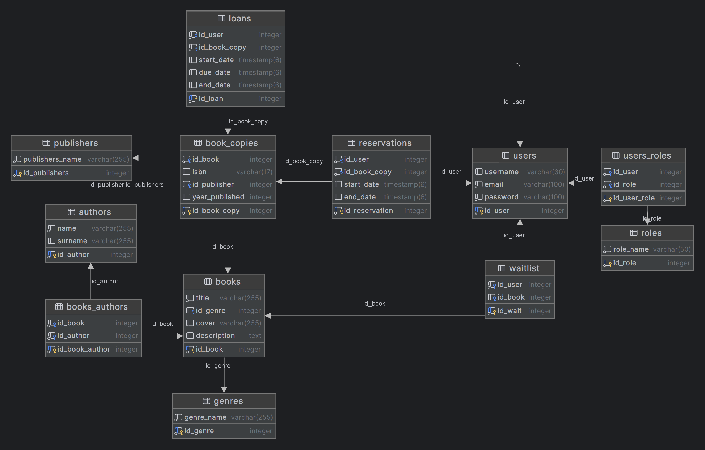

# Biblioteka-ZTPAI
## Contents
* Introduction
* Used technologies
* ERD Diagram
* Features
* Getting Started

## Introduction
The repository contains an implementation of a project called "BiblioSolis". BiblioSolis is a library web application for reserving and borrowing books.

## Used technologies
Spring Boot
- Spring Boot was chosen for its comprehensive support in building web applications. It offers seamless SQL database integration (e.g., PostgreSQL) via Spring Data JPA, robust security with Spring Security. Its extensive documentation and wide community support significantly ease development and troubleshooting.

Postgres
- strong open-source database, with community support, robust performance, and extensive features. It also excels in data integrity through ACID compliance, extensibility through various extensions and data types, and scalability.

RabbitMQ
- The message queuing system will enable asynchronous data processing and efficient management of tasks performed in the background.

pgAdmin
- Selected for easy and complete management of Postgres database

React
- React was selected for its high performance with dynamic data thanks to the virtual DOM, and for its modularity enabled by functional components and hooks. It allows easy communication with a Spring Boot backend via Fetch API or Axios. Additionally, its large community, extensive tutorials, and ready-made components accelerate development.

## ERD Diagram


## Features

1. **Registration**
    - User can register to the service.

2. **JWT Authentication**
    - Session and authentication is managed by JWT token.

3. **RabbitMQ Integration**
    - After registration a message gets sent to user email.

4. **Browsing the library catalog**
    - User can browse the wide library catalog.

5. **Reserving books by user**
    - Users can create reservations on chosen book to borrow it later.

6. **Loaning books by admin**
    - Admin can loan a book to user who reserved a book.

7. **Returning books by admin**
    - Admin can set returned book to be available again

## Getting Started

### Prerequisites
You need the following installed on your computer to run this application:
- Docker.
- Java 17 or higher installed.
- Node.js.

### Clone the repository

```bash
git clone https://github.com/PatMag9/Biblioteka-ZTPAI
```

##### Build and Run the Application
navigate to application root folder
```bash
cd Biblioteka-ZTPAI
```
run the docker-compose file
```bash
docker-compose up --build
```

After thats done, you can access the application by typing `http://localhost:5173` in your browser.